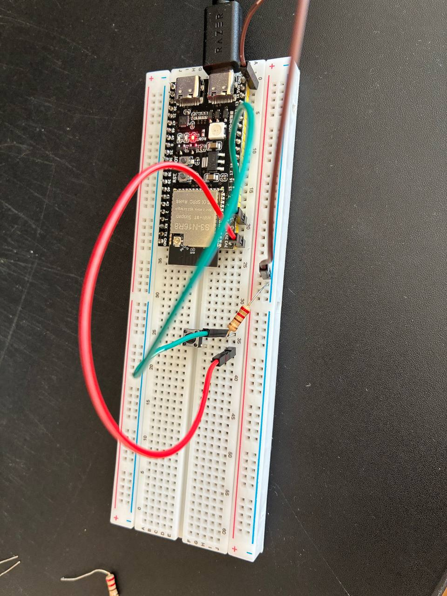
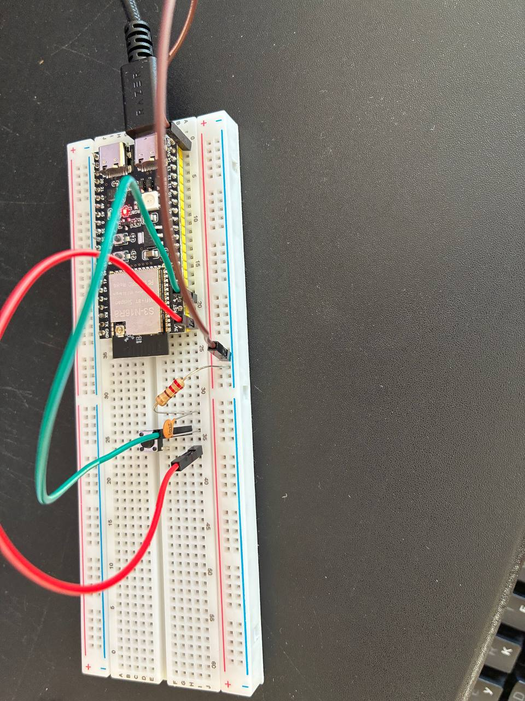

# Homework 2.4

| Метод | Кількість хибних спрацювань | Затримка | Складність | Коментар |
|---|---:|---:|---|---|
| Без debounce | 🔴 31/10 | ~0 ms | 🟢 низька | Дуже різні результати спроба від спроби. До  8 спрацювань з кліку |
| Time-based | 🔴/🟢  | 50–100 ms | 🟢 низька | 50мс спрацювали погано, 100 мс майже ідеально |
| State-based | 🟢20/20 | ~0 ms | 🟡 середня | |
| Polling | 🟡 11/10 залежить | ~10 ms | 🟢 низька |  |
| Hardware RC | 🟢 10/10 | невелика | 🟡 середня | Гарно працює незалежно від програмної частини |

# hardware 

